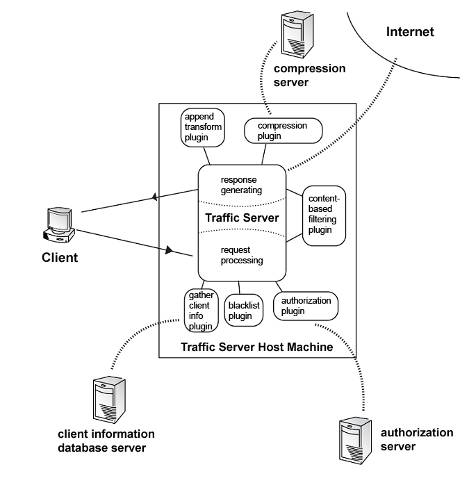
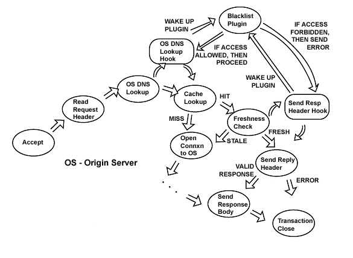

# plugin Example 讲解

   
1. Blacklisting plugin: 拒绝未授权网站的访问  
2. Append transform plugin:将文本添加到HTTP响应内容。  
3. Image conversion plugin:将JPEG图像转换为GIF图像。  
4. Compression plugin: 将响应内容发送给压缩数据的压缩服务器\(或者,压缩库本地交通服务器主机可以压缩\)。  
5. Authorization plugin:检查用户的权限来访问特定的网站。插件可以咨询当地授权程序或向服务器发送查询授权。  
6. A plugin that gathers client information from request headers and enters this information in a database.  
7. Protocol plugin:指定的端口上侦听特定的协议请求,然后使用交通服务器的缓存代理服务器和客户机请求。

## blacklist\_plugin 讲解

功能：指定域名的请求列入黑名单后进行拒绝操作。  
流程：

1. Hook 事件TS\_HTTP\_OS\_DNS\_HOOK；
2. TS\_EVENT\_HTTP\_OS\_DNS事件触发后，判断对应的请求HOST是否为黑名单中所列；
3. HOST 为黑名单中列举，直接HOOK事件TS\_HTTP\_SEND\_RESPONSE\_HDR\_HOOK，然后发送TSHttpTxnReenable\(txnp, TS\_EVENT\_HTTP\_ERROR\);进入第4步骤；
4. TS\_EVENT\_HTTP\_SEND\_RESPONSE\_HDR 事件触发，发送拒绝消息。
5. 如果 HOST 为不是黑名单中列举的域名，直接调用TSHttpTxnReenable\(txnp, TS\_EVENT\_HTTP\_CONTINUE\);走正常流程

相关函数API：

1. TSHttpHookAdd\(TS\_HTTP\_OS\_DNS\_HOOK, TSContCreate\(blacklist\_plugin, NULL\)\);
2. TSHttpTxnHookAdd\(txnp, TS\_HTTP\_SEND\_RESPONSE\_HDR\_HOOK, contp\);
3. TSHttpTxnClientRespGet\(txnp, &bufp, &hdr\_loc\) 
4. TSHttpTxnClientReqGet\(txnp, &bufp, &hdr\_loc\) != TS\_SUCCESS
5. TSHttpHdrUrlGet\(bufp, hdr\_loc, &url\_loc\) 
6. TSUrlHostGet\(bufp, url\_loc, &host\_length\);
7. TSUrlStringGet\(bufp, url\_loc, &url\_length\);
8. TSHttpHdrStatusSet\(bufp, hdr\_loc, TS\_HTTP\_STATUS\_FORBIDDEN\);
9. TSHttpHdrReasonSet\(bufp,hdr\_loc,TSHttpHdrReasonLookup\(TS\_HTTP\_STATUS\_FORBIDDEN\),strlen\(TSHttpHdrReasonLookup\(TS\_HTTP\_STATUS\_FORBIDDEN\)\)\);
10. TSHttpTxnErrorBodySet\(txnp, buf, strlen\(buf\), NULL\);
11. TSHandleMLocRelease\(bufp, TS\_NULL\_MLOC, hdr\_loc\);
12. TSHttpTxnReenable\(txnp, TS\_EVENT\_HTTP\_CONTINUE\);
    整个HTTP状态流程图如下：
     

## Append transform plugin 讲解

## Image conversion plugin 讲解

## Compression plugin 讲解

## Authorization plugin 讲解

## Protocol plugin 讲解

