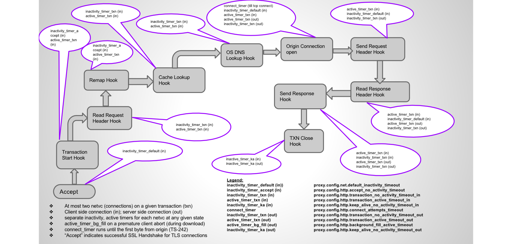

	
# Plugin 的创建流程
1. 你想基于API提供的功能和traffic server做一个什么样的插件。SDK提供的两种示例插件是基于http插件（包括基于头和响应变换）,和non-HTTP-based(协议插件)。这些例子将在以下章节中讨论
2. 确定你的插件需要钩住traffic server HTTP处理流程中的哪个事件（查看HTTP事务状态图）。
3. 阅读 *Header-Based Plugin Examples *  写作插件:创建continuations 和设置钩子。如果你想编写一个插件,转换数据,然后可以读 * HTTP Transformations*。
4. 找出traffic server API的哪些部分需要使用,然后读到这些API的细节。
5. 编译和加载你的插件。
6. 测试查看对应的日志信息。

 


##  Plugins 编译
## Plugin 配置
## Plugin 管理
## Plugin API 说明
## HTTP Transacation Timers
 


## HTTP Sessions
一个HTTP session 与客户端的的TCP 链接对应的对象，一个HTTP请求和HTTP响应构成了一个HTTP transaction，一个TCP链接上可以发送多多个HTTP请求和HTTP 响应，
The HTTP session的钩子如下：

- TS_HTTP_SSN_START_HOOK must be added as a global hook，回调于 客户端请求与traffic server 建立TCP链接的时候；
- TS_HTTP_SSN_CLOSE_HOOK must be added as a global hook，回调于客户端 与 traffic server TCP 链接断开的时候；

Note: 在session hook 事件处理完后，必须要用TSHttpSsnReenable 函数。

session 相关的函数如下： 

- TSHttpSsnHookAdd()
- TSHttpSsnReenable()

## HTTP Transactions
Transactions 是一个定义为一个HTTP 请求和HTTP响应的 生命周期的一个HTTP 事务 。TSHttpTxn ，
```cpp
/*
* Simple plugin that illustrates:
* - how to register locally to a transaction
* - how to deal with data that's associated with a tranaction
*
* Note: for readability, error checking is omitted
*/

#include <ts/ts.h>

#define DBG_TAG "txn"

/* Structure to be associated to txns */
typedef struct {
   int i;
   float f;
   char *s;
} TxnData;

/* Allocate memory and init a TxnData structure */
TxnData *
txn_data_alloc()
{
   TxnData *data;
   data = TSmalloc(sizeof(TxnData));

   data->i = 1;
   data->f = 0.5;
   data->s = "Constant String";
   return data;
}

/* Free up a TxnData structure */
void
txn_data_free(TxnData *data)
{
   TSfree(data);
}

/* Handler for event READ_REQUEST and TXN_CLOSE */
static int
local_hook_handler (TSCont contp, TSEvent event, void *edata)
{
   TSHttpTxn txnp = (TSHttpTxn) edata;
   TxnData *txn_data = TSContDataGet(contp);
   switch (event) {
   case TS_EVENT_HTTP_READ_REQUEST_HDR:
      /* Modify values of txn data */
      txn_data->i = 2;
      txn_data->f = 3.5;
      txn_data->s = "Constant String 2";
      break;

   case TS_EVENT_HTTP_TXN_CLOSE:
      /* Print txn data values */
      TSDebug(DBG_TAG, "Txn data i=%d f=%f s=%s", txn_data->i, txn_data->f, txn_data->s);

      /* Then destroy the txn cont and its data */
      txn_data_free(txn_data);
      TSContDestroy(contp);
      break;

   default:
       TSAssert(!"Unexpected event");
       break;
   }

   TSHttpTxnReenable(txnp, TS_EVENT_HTTP_CONTINUE);
   return 1;
}

/* Handler for event TXN_START */
static int
global_hook_handler (TSCont contp, TSEvent event, void *edata)
{
   TSHttpTxn txnp = (TSHttpTxn) edata;
   TSCont txn_contp;
   TxnData *txn_data;

   switch (event) {
   case TS_EVENT_HTTP_TXN_START:
      /* Create a new continuation for this txn and associate data to it */
      txn_contp = TSContCreate(local_hook_handler, TSMutexCreate());
      txn_data = txn_data_alloc();
      TSContDataSet(txn_contp, txn_data);

      /* Registers locally to hook READ_REQUEST and TXN_CLOSE */
      TSHttpTxnHookAdd(txnp, TS_HTTP_READ_REQUEST_HDR_HOOK, txn_contp);
      TSHttpTxnHookAdd(txnp, TS_HTTP_TXN_CLOSE_HOOK, txn_contp);
      break;

   default:
      TSAssert(!"Unexpected event");
      break;
   }

   TSHttpTxnReenable(txnp, TS_EVENT_HTTP_CONTINUE);
   return 1;
}


void
TSPluginInit (int argc, const char *argv[])
{
   TSCont contp;

   /* Note that we do not need a mutex for this txn since it registers globally
      and doesn't have any data associated with it */
   contp = TSContCreate(global_hook_handler, NULL);

   /* Register gloabally */
   TSHttpHookAdd(TS_HTTP_TXN_START_HOOK, contp);
}
```
The HTTP transaction functions are:

TSHttpTxnCacheLookupStatusGet()
TSHttpTxnCachedReqGet() - Note that it is an error to modify cached headers.
TSHttpTxnCachedRespGet() - Note that it is an error to modify cached headers.
TSHttpTxnClientReqGet() - Plugins that must read client request headers use this call to retrieve the HTTP header.
TSHttpTxnClientRespGet()
TSHttpTxnErrorBodySet()
TSHttpTxnHookAdd()
TSHttpTxnNextHopAddrGet()
TSHttpTxnParentProxySet()
TSHttpTxnReenable()
TSHttpTxnServerAddrGet()
TSHttpTxnServerAddrSet()
TSHttpTxnServerReqGet()
TSHttpTxnServerRespGet()
TSHttpTxnSsnGet()
TSHttpTxnTransformedRespCache()
TSHttpTxnTransformRespGet()
TSHttpTxnUntransformedRespCache()
## Intercepting HTTP Transactions
拦截HTTP 事务函数，可以让插件在接到HTTP请求后，或者与源站建立链接之间进行拦截。插件然后使用TSVConn作为源服务器接口，扮演一个源站的角色。
TSHttpTxnIntercept()

## Initiate HTTP Connection
TSHttpConnect()

## HTTP Alternate Selection
```cpp
static void handle_select_alt(TSHttpAltInfo infop)
{
   TSMBuffer client_req_buf, cache_resp_buf;
   TSMLoc client_req_hdr, cache_resp_hdr;

   TSMLoc accept_transform_field;
   TSMLoc content_transform_field;

   int accept_transform_len = -1, content_transform_len = -1;
   const char* accept_transform_value = NULL;
   const char* content_transform_value = NULL;
   int content_plugin, accept_plugin;

   float quality;

   /* get client request, cached request and cached response */
   TSHttpAltInfoClientReqGet (infop, &client_req_buf, &client_req_hdr);
   TSHttpAltInfoCachedRespGet(infop, &cache_resp_buf, &cache_resp_hdr);

   /* get the Accept-Transform field value from the client request */
   accept_transform_field = TSMimeHdrFieldFind(client_req_buf,
      client_req_hdr, "Accept-Transform", -1);
   if (accept_transform_field) {
      TSMimeHdrFieldValueStringGet(client_req_buf, client_req_hdr,
         accept_transform_field, 0, &accept_transform_value, &accept_transform_len);
      TSDebug(DBG_TAG, "Accept-Transform = |%s|",
         accept_transform_value);
   }

   /* get the Content-Transform field value from cached server response */
   content_transform_field = TSMimeHdrFieldFind(cache_resp_buf,
      cache_resp_hdr, "Content-Transform", -1);
   if (content_transform_field) {
      TSMimeHdrFieldValueStringGet(cache_resp_buf, cache_resp_hdr,
         content_transform_field, 0, &content_transform_value, &content_transform_len);
      TSDebug(DBG_TAG, "Content-Transform = |%s|",
         content_transform_value);
   }

   /* compute quality */
   accept_plugin = (accept_transform_value && (accept_transform_len > 0) &&
      (strncmp(accept_transform_value, "plugin",
         accept_transform_len) == 0));

   content_plugin = (content_transform_value && (content_transform_len >0) &&
      (strncmp(content_transform_value, "plugin",
         content_transform_len) == 0));

   if (accept_plugin) {
      quality = content_plugin ? 1.0 : 0.0;
   } else {
      quality = content_plugin ? 0.0 : 0.5;
   }

   TSDebug(DBG_TAG, "Setting quality to %3.1f", quality);

   /* set quality for this alternate */
   TSHttpAltInfoQualitySet(infop, quality);

   /* cleanup */
   if (accept_transform_field)
      TSHandleMLocRelease(client_req_buf, client_req_hdr,
         accept_transform_field);
   TSHandleMLocRelease(client_req_buf, TS_NULL_MLOC, client_req_hdr);

   if (content_transform_field)
      TSHandleMLocRelease(cache_resp_buf, cache_resp_hdr,
         content_transform_field);
   TSHandleMLocRelease(cache_resp_buf, TS_NULL_MLOC, cache_resp_hdr);
}

static int alt_plugin(TSCont contp, TSEvent event, void *edata)
{
   TSHttpAltInfo infop;

   switch (event) {
      case TS_EVENT_HTTP_SELECT_ALT:
         infop = (TSHttpAltInfo)edata;
         handle_select_alt(infop);
         break;

      default:
         break;
   }

   return 0;
}

void TSPluginInit (int argc, const char *argv[])
{
   TSHttpHookAdd(TS_HTTP_SELECT_ALT_HOOK, TSContCreate (alt_plugin,
      NULL));
}
```

相关函数

* TSHttpAltInfoCachedReqGet
* TSHttpAltInfoCachedRespGet
* TSHttpAltInfoClientReqGet
* TSHttpAltInfoQualitySet


### Plugin Interfaces
TSfopen Family
基于性能方面的考虑,不应该直接使用这些api 在traffic server线程( HTTP 事件回调),最好是使用一个单独的线程做阻塞IO。

- TSfclose()
- TSfflush()
- TSfgets()
- TSfopen()
- TSfread()
- TSfwrite()
Memory Allocation

- TSfree()
- TSmalloc()
- TSrealloc()
- TSstrdup()
- TSstrndup()
Thread Functions

- TSThreadCreate()
- TSThreadDestroy()
- TSThreadInit()
- TSThreadSelf()

Debugging Functions

- TSDebug() prints out a formatted statement if you are running Traffic Server in debug mode.
- TSIsDebugTagSet() checks to see if a debug tag is set. If the debug tag is set, then Traffic Server prints out all debug statements associated with the tag.
- TSError() prints error messages to Traffic Server’s error log
- TSAssert() enables the use of assertion in a plugin.
- TSReleaseAssert() enables the use of assertion in a plugin.

### Logging API

- TSTextLogObjectCreate()：建立一个自定义的文本日志:；
- TSTextLogObjectHeaderSet()：设置日志标题；
- TSTextLogObjectRollingEnabledSet()：启用或禁用滚动您的自定义文本日志；
- TSTextLogObjectRollingIntervalSecSet()：为您的自定义文本日志设置滚动间隔事件(以秒为单位)；
- TSTextLogObjectRollingOffsetHrSet()：自定义文本日志设置滚动间隔(以秒为单位)；
- TSTextLogObjectRollingSizeMbSet()：自定义文本日志设置滚动间隔大小(以MB为单位)；
- TSTextLogObjectWrite()：文本写入日志文件中；
- TSTextLogObjectFlush()：刷新自定义文本日志写缓冲区的内容到磁盘:；
- TSTextLogObjectDestroy()：销毁 文本日志 对象

```cpp
static TSTextLogObject log;
TSReturnCode error = TSTextLogObjectCreate("blacklist",TS_LOG_MODE_ADD_TIMESTAMP, &log);
if (log) { 
	TSTextLogObjectWrite(log, "blacklisting site: %s",
	sites[i]);
}
```

TSActionCancel()
TSActionDone()


### Mutexes and Data
有以下三种情况，continuation 必须要创建mutex：

- 全局注册使用TSHttpHookAdd TSHttpSsnHookAdd 挂载的事件中使用了TSContDataSet/Get 类函数；
-  局部注册使用TSHttpTxnHookAdd挂载事件，多个transaction使用了 TSContDataSet/Get 类函数；
-  使用了 TSCacheXXX,TSNetXXX, TSHostLookup，TSContSchedule 这类的函数。


	