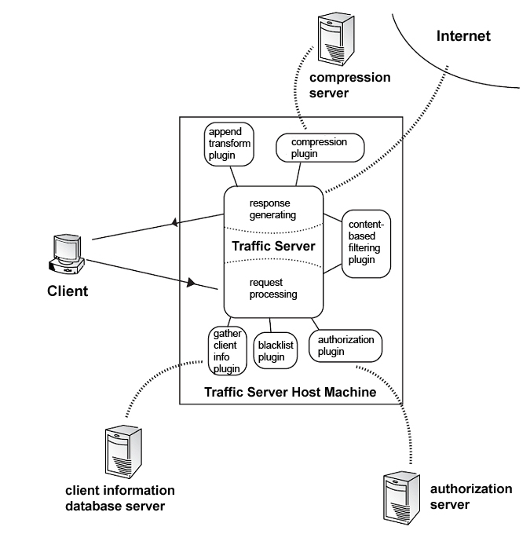
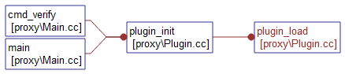
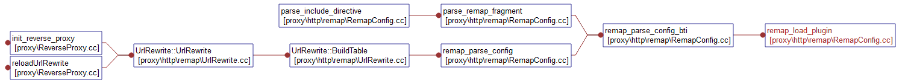
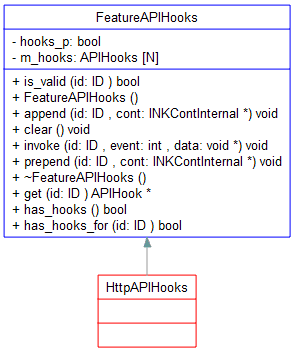
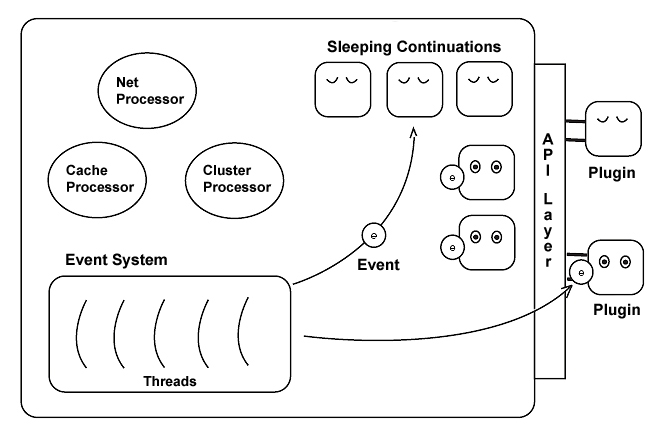

# ATS plugin 原理简介
[TOC]
## ATS  plugin 简介
HTTP事务流程：
	必须要理解的是trafficserver是个程序，主要的业务是无数的transaction，每个transaction都是一个用户的http连接处理，不仅包含了用户的tcp连接，还包含了traffic server与后端的通信和本地操作等。一个transaction只是用户一个tcp连接上执行的一次事务，还有一个session概念，是一个client和server之间tcp概念上的连接。一个session可以包括很多个transaction。对用户来说，一个request和response是一个transaction

原理：
	标准的面向过程做插件的过程。一个HTTP有个处理流程，包括request头部处理（你可以改url），dns查询（你可以决定去哪个后台获取数据）、从后台或缓存拉取数据、返回内容等。只要是http请求，这个流程就是固定的。因此插件系统就是在这些流程上注册回调函数。这里的回调函数还不是直接调用，还会传递一个event事件参数，用于表示在当前的钩子上发生的事情，使plugin可以更好的处理。
     除了被调用，trafficserver还要提供调用方法。这里提供的调用方式可不是一般意义上的函数调用，而是类似远程过程调用。插件通过将自己要被执行的代码（action）发送给server（就连发送都是要指明ip地址和端口的），然后通过查询server返回的接口来获得action执行的状态。这里的action就是traffic server里面的协程概念，整个过程类似golang的go func(){}()关键字操作。
     除了这种远程调用，很多函数插件也是可以直接调用的。
协程：
	Trafficserver的超高并发自然需要协程的概念（ng也是）。Traffic server自己实现的协程叫做continuation，结构体用TSCont表示。
	一个TSCont代表一个异步执行的代码块，这个代码块拥有自己的执行状态，并且可以被
	协程是用户空间管理的线程，也就是说调度算法是在用户空间的程序中实现的。可以保存程序执行的状态，可以在某时刻拉出来执行。多个协程在一个操作系统的线程上执行，或者是M个协程在N个线程上执行。如此带来的好处是可以任性的阻塞，不必担心资源的浪费问题。所以协程本质上也是一种应对阻塞调用的方式。其他的重要思想还有异步。貌似操作系统更倾向于异步，而不是倾向于协程。
	Trafficserver底层大量基于异步，但向上提供的并发却大量基于协程的概念。
插件类型：
	1. 普通插件
	2. 内容变换
	内容变换是修改request的内容或者response的内容。由于内容是变长的，所以traffic server定义了vconnection（结构体TSVConn）和vio。Vconnection代表从一个buffer到另一个buffer的连接，经过这个连接的数据可以根据连接指定的变化方法变化。这也就是内容变换的本质。本质上TSVConn是一个continuation，所以也具备协continuation具备的数据通知能力。 而VIO是VConnection两端。一个input一个output，由于可以多个vconnection串行，所以一个vconnection的output vio就可以另一个vconnection的input。Vconnection的本质是变换，VIO的本质是内存buffer。
	2.其他协议插件
	这个就比较底层了。一般的插件都是服务于http协议的，你也可以直接跳过http协议支持别的协议，或者是支持http之上的其他协议。课件traffic server对其网络基础结构的信心。

插件编写：
		 1.  向主程序注册插件：TSPluginRegister。可以不注册，主要是为了兼容性
		 2.  向某个全局钩子位置添加钩子回调：TSHttpHookAdd
			-  注册的钩子可以是全局的也可能是trasaction、session相关的。如果是transaction相关的，通过TSHttpTxn txnp = (TSHttpTxn)edata;获得transaction的指针。使用TSHttpTxnHookAdd函数添加transactionhook。
			-   如果是session相关的，使用TSHttpSsnHookAdd进行注册。Plugin中获得session的方法变为TSHttpSsn ssion = (TSHttpSsn)edata;
 
插件允许发起网络连接，使用TSNetConnect()发起只连接traffic server的http连接，TSHttpConnect()发起向任意地址的http连接。

## ATS plugin 的应用 
 

##  ATS 如何知道插件的存在？ 
ATS 有一个配置插件的配置文件，通过读取配置文件里面的条目，然后使用dlsym方法把插件so文件中的 TSPluginInit 函数指针找出来，形成一个数据结构，保存在PluginRegInfo类型的 plugin_reg_list对象中（对象含有动态库的文件句柄）。 
path = RecConfigReadConfigPath(NULL, "plugin.config");
TSPluginInit 调用过程
 
```cpp
#0  TSPluginInit (argc=1, argv=0x7fffffffe060) at stats_over_http.c:326
#1  0x00000000004e110a in plugin_load (validateOnly=false) at Plugin.cc:126
#2  plugin_init (validateOnly=false) at Plugin.cc:283
#3  0x00000000004d7e4f in main (argv=<value optimized out>) at Main.cc:1796
```

```cpp
init = (init_func_t)dlsym(plugin_reg_current->dlh, "TSPluginInit");
if (!init) {
    delete plugin_reg_current;
    if (validateOnly) {
        return false;
    }
    Fatal("unable to find TSPluginInit function in '%s': %s", path, dlerror());
    return false; // this line won't get called since Fatal brings down ATS
}
init(argc, argv);// 调用TSPluginInit
```
关于 dlsym 函数的使用：
假设在my.so中定义了一个void mytest()函数，那在使用my.so时先声明一个函数指针：
```cpp
void(*pMytest)();
```
接下来先将那个my.so载入：
```cpp
pHandle=dlopen("my.so",RTLD_LAZY);//详见dlopen函数
```
然后使用dlsym函数将函数指针 pMytest 指向 mytest() 函数：
```cpp
pMytest=(void(*)())dlsym(pHandle,"mytest");//可见放在双引号中的mytest不用加括号,即使有参数也不用
```
（可调用dlerror();返回错误信息，正确返回为空）
最后通过调用函数指针执行mytest函数：
```cpp
int main(){
    //......
    pMytest();
    //......
    return0;
}
```

TSRemapNewInstance 调用过程
 
```cpp
(gdb) bt
#0  TSRemapNewInstance (argc=2, argv=0x7ffffffe7560, instance_handle=0x7ffffffece28, errbuf=0x7ffffffec560 "", errbuf_size=2047)
    at RemapPlugin.cc:90
#1  0x00000000005f966f in remap_load_plugin (argv=0x7fffffff2040, argc=<value optimized out>, mp=<value optimized out>, 
    errbuf=0x7ffffffed720 "", errbufsize=1024, jump_to_argc=<value optimized out>, plugin_found_at=0x7ffffffedfd0)
    at RemapConfig.cc:862
#2  0x00000000005fcaf3 in remap_parse_config_bti (path=0x1268dd0 "/home/wanrui/ts_install_6.1.1/etc/trafficserver/remap.config", 
    bti=0x7ffffffee030) at RemapConfig.cc:1317
#3  0x00000000005fd9e2 in remap_parse_config (path=0x1268dd0 "/home/wanrui/ts_install_6.1.1/etc/trafficserver/remap.config", 
    rewrite=0x12741a0) at RemapConfig.cc:1367
#4  0x00000000005f5d2a in UrlRewrite::BuildTable (this=0x12741a0, 
    path=0x1268dd0 "/home/wanrui/ts_install_6.1.1/etc/trafficserver/remap.config") at UrlRewrite.cc:686
#5  0x00000000005f879d in UrlRewrite::UrlRewrite (this=0x12741a0) at UrlRewrite.cc:92
#6  0x00000000004e8b6c in init_reverse_proxy () at ReverseProxy.cc:75
#7  0x000000000058348a in init_HttpProxyServer (n_accept_threads=1) at HttpProxyServerMain.cc:242
#8  0x00000000004d802d in main (argv=<value optimized out>) at Main.cc:1846
```
remap 插件对应函数从so 文件中加载：
```cpp
remap_load_plugin--
      pi->fp_tsremap_init = (remap_plugin_info::_tsremap_init *)dlsym(pi->dlh, TSREMAP_FUNCNAME_INIT);
      pi->fp_tsremap_done = (remap_plugin_info::_tsremap_done *)dlsym(pi->dlh, TSREMAP_FUNCNAME_DONE);
      pi->fp_tsremap_new_instance = (remap_plugin_info::_tsremap_new_instance *)dlsym(pi->dlh, TSREMAP_FUNCNAME_NEW_INSTANCE);
      pi->fp_tsremap_delete_instance =
        (remap_plugin_info::_tsremap_delete_instance *)dlsym(pi->dlh, TSREMAP_FUNCNAME_DELETE_INSTANCE);
      pi->fp_tsremap_do_remap = (remap_plugin_info::_tsremap_do_remap *)dlsym(pi->dlh, TSREMAP_FUNCNAME_DO_REMAP);
      pi->fp_tsremap_os_response = (remap_plugin_info::_tsremap_os_response *)dlsym(pi->dlh, TSREMAP_FUNCNAME_OS_RESPONSE);
```
remap_plugin_info 插件类的内容如下，需要实现的函数如下

```cpp
#define TSREMAP_FUNCNAME_INIT "TSRemapInit"
#define TSREMAP_FUNCNAME_DONE "TSRemapDone"
#define TSREMAP_FUNCNAME_NEW_INSTANCE "TSRemapNewInstance"
#define TSREMAP_FUNCNAME_DELETE_INSTANCE "TSRemapDeleteInstance"
#define TSREMAP_FUNCNAME_DO_REMAP "TSRemapDoRemap"
#define TSREMAP_FUNCNAME_OS_RESPONSE "TSRemapOSResponse"
```

 1. _tsremap_init：TSRemapInit
 2. _tsremap_done:TSRemapDone
 3.  _tsremap_new_instance:TSRemapNewInstance
 4.   _tsremap_delete_instance；TSRemapDeleteInstance
 5.   _tsremap_do_remap：TSRemapDoRemap
 6.   _tsremap_os_responseTSRemapOSResponse

```cpp
class remap_plugin_info
{
public:
  typedef TSReturnCode _tsremap_init(TSRemapInterface *api_info, char *errbuf, int errbuf_size);
  typedef void _tsremap_done(void);
  typedef TSReturnCode _tsremap_new_instance(int argc, char *argv[], void **ih, char *errbuf, int errbuf_size);
  typedef void _tsremap_delete_instance(void *);
  typedef TSRemapStatus _tsremap_do_remap(void *ih, TSHttpTxn rh, TSRemapRequestInfo *rri);
  typedef void _tsremap_os_response(void *ih, TSHttpTxn rh, int os_response_type);

  remap_plugin_info *next;
  char *path;
  int path_size;
  void *dlh; /* "handle" for the dynamic library */
  _tsremap_init *fp_tsremap_init;
  _tsremap_done *fp_tsremap_done;
  _tsremap_new_instance *fp_tsremap_new_instance;
  _tsremap_delete_instance *fp_tsremap_delete_instance;
  _tsremap_do_remap *fp_tsremap_do_remap;
  _tsremap_os_response *fp_tsremap_os_response;

  remap_plugin_info(char *_path);
  ~remap_plugin_info();

  remap_plugin_info *find_by_path(char *_path);
  void add_to_list(remap_plugin_info *pi);
  void delete_my_list();
};
```
##  ATS 如何hook到对应的事件？
ATS 可以使用如下方法进行对应事件的监听：
```cc
tsapi void TSLifecycleHookAdd(TSLifecycleHookID id, TSCont contp);
tsapi void TSHttpHookAdd(TSHttpHookID id, TSCont contp);
tsapi void TSHttpSsnHookAdd(TSHttpSsn ssnp, TSHttpHookID id, TSCont contp);
tsapi void TSHttpTxnHookAdd(TSHttpTxn txnp, TSHttpHookID id, TSCont contp);
tsapi const char *TSHttpHookNameLookup(TSHttpHookID hook);
```
上面已经介绍ATS如何通过配置文件，加载起来对应的插件了。在加载的过程中，势必会调用 TSPluginInit 函数。这个函数
插件使用TSHttpHookAdd 函数进行具体事件的挂载。标准的使用方法如下：
```cc
TSHttpHookAdd(TS_HTTP_READ_REQUEST_HDR_HOOK, TSContCreate(stats_origin, NULL));
```
通过TSContCreate 创建一个Continuation ，然后传入http_global_hooks对象中保存
```cc
void
TSHttpHookAdd(TSHttpHookID id, TSCont contp)
{
  INKContInternal *icontp;
  sdk_assert(sdk_sanity_check_continuation(contp) == TS_SUCCESS);
  sdk_assert(sdk_sanity_check_hook_id(id) == TS_SUCCESS);

  icontp = reinterpret_cast<INKContInternal *>(contp);

  if (id >= TS_SSL_FIRST_HOOK && id <= TS_SSL_LAST_HOOK) {
    TSSslHookInternalID internalId = static_cast<TSSslHookInternalID>(id - TS_SSL_FIRST_HOOK);
    ssl_hooks->append(internalId, icontp);
  } else { // Follow through the regular HTTP hook framework
    http_global_hooks->append(id, icontp);
  }
}
/* HTTP transactions */
void
TSHttpTxnHookAdd(TSHttpTxn txnp, TSHttpHookID id, TSCont contp)
{
  sdk_assert(sdk_sanity_check_txn(txnp) == TS_SUCCESS);
  sdk_assert(sdk_sanity_check_continuation(contp) == TS_SUCCESS);
  sdk_assert(sdk_sanity_check_hook_id(id) == TS_SUCCESS);

  HttpSM *sm = (HttpSM *)txnp;
  sm->txn_hook_append(id, (INKContInternal *)contp);
}

/* HTTP sessions */
void
TSHttpSsnHookAdd(TSHttpSsn ssnp, TSHttpHookID id, TSCont contp)
{
  sdk_assert(sdk_sanity_check_http_ssn(ssnp) == TS_SUCCESS);
  sdk_assert(sdk_sanity_check_continuation(contp) == TS_SUCCESS);
  sdk_assert(sdk_sanity_check_hook_id(id) == TS_SUCCESS);

  HttpClientSession *cs = (HttpClientSession *)ssnp;
  cs->ssn_hook_append(id, (INKContInternal *)contp);
}
```
http_global_hooks 定义类型为HttpAPIHooks，这个类的继承关系如下:  
 

```cpp
class APIHooks
{
public:
  void prepend(INKContInternal *cont);
  void append(INKContInternal *cont);
  APIHook *get() const;
  void clear();
  bool is_empty() const;
  void invoke(int event, void *data);

private:
  Que(APIHook, m_link) m_hooks;
};

inline void
APIHooks::invoke(int event, void *data)
{
  for (APIHook *hook = m_hooks.head; NULL != hook; hook = hook->next())
    hook->invoke(event, data);
}
```


```cpp
#0  stats_origin (contp=0x1150fa0, event=TS_EVENT_HTTP_READ_REQUEST_HDR, edata=0x7fffede27080) at stats_over_http.c:260
#1  0x0000000000599aa5 in HttpSM::state_api_callout (this=0x7fffede27080, event=<value optimized out>, data=<value optimized out>)
    at HttpSM.cc:1382
#2  0x000000000059f410 in HttpSM::set_next_state (this=0x7fffede27080) at HttpSM.cc:6955
#3  0x00000000005963bc in HttpSM::state_read_client_request_header (this=0x7fffede27080, event=<value optimized out>, 
    data=<value optimized out>) at HttpSM.cc:771
#4  0x000000000059b1b8 in HttpSM::main_handler (this=0x7fffede27080, event=100, data=0x7fffe0017e38) at HttpSM.cc:2561
#5  0x00000000005987d2 in handleEvent (this=0x7fffede27080) at ../../iocore/eventsystem/I_Continuation.h:153
#6  setup_client_read_request_header (this=0x7fffede27080) at HttpSM.cc:565
#7  HttpSM::handle_api_return (this=0x7fffede27080) at HttpSM.cc:1507
#8  0x0000000000599c93 in HttpSM::state_api_callout (this=0x7fffede27080, event=<value optimized out>, data=0x0) at HttpSM.cc:1464
#9  0x00000000005a07d8 in do_api_callout_internal (this=0x7fffede27080, client_vc=<value optimized out>, 
    buffer_reader=<value optimized out>) at HttpSM.cc:4914
#10 do_api_callout (this=0x7fffede27080, client_vc=<value optimized out>, buffer_reader=<value optimized out>) at HttpSM.cc:391
#11 state_add_to_list (this=0x7fffede27080, client_vc=<value optimized out>, buffer_reader=<value optimized out>) at HttpSM.cc:418
#12 HttpSM::attach_client_session (this=0x7fffede27080, client_vc=<value optimized out>, buffer_reader=<value optimized out>)
    at HttpSM.cc:544
#13 0x000000000057953c in HttpClientSession::new_transaction (this=0x7fffe801cd40) at HttpClientSession.cc:141
#14 0x00000000004e8449 in state_api_callout (this=0x7fffe801cd40, id=<value optimized out>) at ProxyClientSession.cc:119
#15 ProxyClientSession::do_api_callout (this=0x7fffe801cd40, id=<value optimized out>) at ProxyClientSession.cc:145
#16 0x000000000057b274 in HttpClientSession::new_connection (this=0x7fffe801cd40, new_vc=<value optimized out>, 
    iobuf=<value optimized out>, reader=<value optimized out>, backdoor=false) at HttpClientSession.cc:220
#17 0x0000000000575469 in HttpSessionAccept::accept (this=0x1276580, netvc=0x7fffe0017d20, iobuf=0x1275da0, reader=0x1275db8)
    at HttpSessionAccept.cc:74
#18 0x00000000004e7d03 in ProtocolProbeTrampoline::ioCompletionEvent (this=0x7fffe8000970, event=<value optimized out>, 
    edata=<value optimized out>) at ProtocolProbeSessionAccept.cc:123
#19 0x0000000000724ef9 in handleEvent (event=<value optimized out>, vc=0x7fffe0017d20)
    at ../../iocore/eventsystem/I_Continuation.h:153
#20 read_signal_and_update (event=<value optimized out>, vc=0x7fffe0017d20) at UnixNetVConnection.cc:150
#21 0x0000000000729bde in read_from_net (nh=0x7ffff6721b90, vc=0x7fffe0017d20, thread=0x7ffff671e010) at UnixNetVConnection.cc:390
#22 0x000000000071b4c0 in NetHandler::mainNetEvent (this=0x7ffff6721b90, event=<value optimized out>, e=<value optimized out>)
    at UnixNet.cc:518
#23 0x00000000007489a5 in handleEvent (this=0x7ffff671e010, e=0x1094d00, calling_code=5) at I_Continuation.h:153
#24 EThread::process_event (this=0x7ffff671e010, e=0x1094d00, calling_code=5) at UnixEThread.cc:128
#25 0x00000000007492e9 in EThread::execute (this=0x7ffff671e010) at UnixEThread.cc:252
#26 0x0000000000747e1a in spawn_thread_internal (a=0x1067450) at Thread.cc:86
#27 0x00000039040079d1 in start_thread () from /lib64/libpthread.so.0
#28 0x0000003903ce8b5d in clone () from /lib64/libc.so.6
```
```cpp
    This set of enums represents the possible hooks where you can
    set up continuation callbacks. The functions used to register a
    continuation for a particular hook are:

    TSHttpHookAdd: adds a global hook. You can globally add
    any hook except for
     - TS_HTTP_REQUEST_TRANSFORM_HOOK
     - TS_HTTP_RESPONSE_TRANSFORM_HOOK
     - TS_HTTP_RESPONSE_CLIENT_HOOK

    The following hooks can ONLY be added globally:
     - TS_HTTP_SELECT_ALT_HOOK
     - TS_HTTP_SSN_START_HOOK
     - TS_HTTP_SSN_CLOSE_HOOK

    TSHttpSsnHookAdd: adds a transaction hook to each transaction
    within a session. You can only use transaction hooks with this call:
     - TS_HTTP_READ_REQUEST_HDR_HOOK
     - TS_HTTP_OS_DNS_HOOK
     - TS_HTTP_SEND_REQUEST_HDR_HOOK
     - TS_HTTP_READ_CACHE_HDR_HOOK
     - TS_HTTP_READ_RESPONSE_HDR_HOOK
     - TS_HTTP_SEND_RESPONSE_HDR_HOOK
     - TS_HTTP_REQUEST_TRANSFORM_HOOK
     - TS_HTTP_RESPONSE_TRANSFORM_HOOK
     - TS_HTTP_RESPONSE_CLIENT_HOOK
     - TS_HTTP_TXN_START_HOOK
     - TS_HTTP_TXN_CLOSE_HOOK

    TSHttpTxnHookAdd: adds a callback at a specific point within
    an HTTP transaction. The following hooks can be used with this
    function:
     - TS_HTTP_READ_REQUEST_HDR_HOOK
     - TS_HTTP_OS_DNS_HOOK
     - TS_HTTP_SEND_REQUEST_HDR_HOOK
     - TS_HTTP_READ_CACHE_HDR_HOOK
     - TS_HTTP_READ_RESPONSE_HDR_HOOK
     - TS_HTTP_SEND_RESPONSE_HDR_HOOK
     - TS_HTTP_REQUEST_TRANSFORM_HOOK
     - TS_HTTP_RESPONSE_TRANSFORM_HOOK
     - TS_HTTP_TXN_CLOSE_HOOK

    The two transform hooks can ONLY be added as transaction hooks.

    TS_VCONN_PRE_ACCEPT_HOOK - Called before the SSL hand
    shake starts.  No handshake data has been read or sent (from the
    proxy) at this point

    TS_HTTP_LAST_HOOK _must_ be the last element. Only right place
    to insert a new element is just before TS_HTTP_LAST_HOOK.
 ```  
## 对应的事件来临如何触发插件挂载的函数？　　
HttpSM.cc  HTTP 事件触发 HttpSM::state_api_callout
```cpp
       if (cur_hook->m_cont->mutex) {
          plugin_mutex = cur_hook->m_cont->mutex;
          plugin_lock = MUTEX_TAKE_TRY_LOCK(cur_hook->m_cont->mutex, mutex->thread_holding);

          if (!plugin_lock) {
            HTTP_SM_SET_DEFAULT_HANDLER(&HttpSM::state_api_callout);
            pending_action = mutex->thread_holding->schedule_in(this, HRTIME_MSECONDS(10));
            return 0;
          }
        } else {
          plugin_lock = false;
        }

        APIHook *hook = cur_hook;
        cur_hook = cur_hook->next();
        hook->invoke(TS_EVENT_HTTP_READ_REQUEST_HDR + cur_hook_id, this);
		
        if (plugin_lock) {
          Mutex_unlock(plugin_mutex, mutex->thread_holding);
        }
```

HttpTransactCache.cc HttpTransactCache::calculate_quality_of_match
```cpp
hook = http_global_hooks->get(TS_HTTP_SELECT_ALT_HOOK);
    if (hook) {
      while (hook) {
        hook->invoke(TS_EVENT_HTTP_SELECT_ALT, &info);
        hook = hook->m_link.next;
      }
```

HttpProxyServerMain.cc start_HttpProxyServer()

```cpp
 // Alert plugins that connections will be accepted.
  APIHook *hook = lifecycle_hooks->get(TS_LIFECYCLE_PORTS_READY_HOOK);
  while (hook) {
    hook->invoke(TS_EVENT_LIFECYCLE_PORTS_READY, NULL);
    hook = hook->next();
  }
```

ProxyClientSession.cc (trafficserver-6.1.1\proxy) ProxyClientSession::state_api_callout

```cpp
 case TS_EVENT_HTTP_CONTINUE:
    if (likely(is_valid_hook(this->api_hookid))) {
      if (this->api_current == NULL && this->api_scope == API_HOOK_SCOPE_GLOBAL) {
        this->api_current = http_global_hooks->get(this->api_hookid);
        this->api_scope = API_HOOK_SCOPE_LOCAL;
      }

      if (this->api_current == NULL && this->api_scope == API_HOOK_SCOPE_LOCAL) {
        this->api_current = ssn_hook_get(this->api_hookid);
        this->api_scope = API_HOOK_SCOPE_NONE;
      }

      if (this->api_current) {
        bool plugin_lock = false;
        APIHook *hook = this->api_current;
        Ptr<ProxyMutex> plugin_mutex;

        if (hook->m_cont->mutex) {
          plugin_mutex = hook->m_cont->mutex;
          plugin_lock = MUTEX_TAKE_TRY_LOCK(hook->m_cont->mutex, mutex->thread_holding);
          if (!plugin_lock) {
            SET_HANDLER(&ProxyClientSession::state_api_callout);
            mutex->thread_holding->schedule_in(this, HRTIME_MSECONDS(10));
            return 0;
          }
        }

        this->api_current = this->api_current->next();
        hook->invoke(eventmap[this->api_hookid], this);

        if (plugin_lock) {
          Mutex_unlock(plugin_mutex, this_ethread());
        }
```

SSLNetVConnection.cc (trafficserver-6.1.1\iocore\net)  SSLNetVConnection::reenable(NetHandler *nh)
```cpp
if (curHook != NULL) {
      curHook = curHook->next();
      if (curHook != NULL) {
        // Invoke the hook
        curHook->invoke(TS_SSL_CERT_HOOK, this);
      }
    }
    if (curHook == NULL) {
      this->sslHandshakeHookState = HANDSHAKE_HOOKS_DONE;
      this->readReschedule(nh);
    }
```

bool
SSLNetVConnection::callHooks(TSHttpHookID eventId)
```cpp
  if (this->sslHandshakeHookState == HANDSHAKE_HOOKS_PRE) {
    this->sslHandshakeHookState = HANDSHAKE_HOOKS_CERT;
  }

  if (this->sslHandshakeHookState == HANDSHAKE_HOOKS_CERT && eventId == TS_SSL_CERT_HOOK) {
    if (curHook != NULL) {
      curHook = curHook->next();
    } else {
      curHook = ssl_hooks->get(TS_SSL_CERT_INTERNAL_HOOK);
    }
  } else {
    // Not in the right state, or no plugins registered for this hook
    // reenable and continue
    return true;
  }

  bool reenabled = true;
  SSLHandshakeHookState holdState = this->sslHandshakeHookState;
  if (curHook != NULL) {
    // Otherwise, we have plugin hooks to run
    this->sslHandshakeHookState = HANDSHAKE_HOOKS_INVOKE;
    curHook->invoke(eventId, this);
    reenabled = (this->sslHandshakeHookState != HANDSHAKE_HOOKS_INVOKE);
  }
  this->sslHandshakeHookState = holdState;
```

## Plugin 异步事件模型
Asynchronous Event Model  

1. 利用可用的多个cpu和多个I / O设备的并发性。
2. 管理并发许多同步客户端连接。例如,一个服务器可以为每个连接创建一个线程,允许操作系统(OS)来控制线程之间切换。

traffic server 内部应该有如下实现：
```cpp
for (;;) {
   event = get_next_event();
   handle_event (event);
}
```

## HTTP HOOK 种类

- Global HTTP hooks
	用TSHttpHookAdd 函数在TSPluginInit函中进行挂载钩子 
- Transaction hooks
	为指定 HTTP transaction挂载钩子，不是在TSPluginInit函数中使用。
	https://docs.trafficserver.apache.org/en/latest/developer-guide/plugins/continuations/writing-handler-functions.en.html
- Transformation hooks	
	使用TSHttpTxnHookAdd 挂载transform 事件
- Session hooks
	TSHttpSsnHookAdd() 
- HTTP select alternate hook

## HTTP HOOK 回调
TSEventFunc 回调函数定义如下：
```cpp
static int function_name (TSCont contp, TSEvent event, void *edata)
```
其中edata 类型的数据根据不同的事件触发类型都不一样，一般HTTP事务 中的回调类型为TSHttpTxn ，所有事件 对应的edata 类型如下：

|   Event  |  Event Sender   |   Data Type  |
| --- | --- | --- |
|	TS_EVENT_HTTP_READ_REQUEST_HDR	|	TS_HTTP_READ_REQUEST_HDR_HOOK	|	TSHttpTxn	|
|	TS_EVENT_HTTP_PRE_REMAP	|	TS_HTTP_PRE_REMAP_HOOK	|	TSHttpTxn	|
|	TS_EVENT_HTTP_OS_DNS	|	TS_HTTP_OS_DNS_HOOK	|	TSHttpTxn	|
|	TS_EVENT_HTTP_SEND_REQUEST_HDR	|	TS_HTTP_SEND_REQUEST_HDR_HOOK	|	TSHttpTxn	|
|	TS_EVENT_HTTP_READ_CACHE_HDR	|	TS_HTTP_READ_CACHE_HDR_HOOK	|	TSHttpTxn	|
|	TS_EVENT_HTTP_READ_RESPONSE_HDR	|	TS_HTTP_READ_RESPONSE_HDR_HOOK	|	TSHttpTxn	|
|	TS_EVENT_HTTP_SEND_RESPONSE_HDR	|	TS_HTTP_SEND_RESPONSE_HDR_HOOK	|	TSHttpTxn	|
|	TS_EVENT_HTTP_SELECT_ALT	|	TS_HTTP_SELECT_ALT_HOOK	|	TSHttpTxn	|
|	TS_EVENT_HTTP_TXN_START	|	TS_HTTP_TXN_START_HOOK	|	TSHttpTxn	|
|	TS_EVENT_HTTP_TXN_CLOSE	|	TS_HTTP_TXN_CLOSE_HOOK	|	TSHttpTxn	|
|	TS_EVENT_HTTP_SSN_START	|	TS_HTTP_SSN_START_HOOK	|	TSHttpSsn	|
|	TS_EVENT_HTTP_SSN_CLOSE	|	TS_HTTP_SSN_CLOSE_HOOK	|	TSHttpSsn	|
|	TS_EVENT_NONE	|		|		|
|	TS_EVENT_CACHE_LOOKUP_COMPLETE	|	TS_HTTP_CACHE_LOOKUP_COMPLETE_HOOK	|	TSHttpTxn	|
|	TS_EVENT_IMMEDIATE	|	TSVConnClose() TSVIOReenable()TSContSchedule()	|		|
|	TS_EVENT_IMMEDIATE	|	TS_HTTP_REQUEST_TRANSFORM_HOOK	|		|
|	TS_EVENT_IMMEDIATE	|	TS_HTTP_RESPONSE_TRANSFORM_HOOK	|		|
|	TS_EVENT_CACHE_OPEN_READ	|	TSCacheRead()	|	Cache VC	|
|	TS_EVENT_CACHE_OPEN_READ_FAILED	|	TSCacheRead()	|	TS_CACHE_ERROR code	|
|	TS_EVENT_CACHE_OPEN_WRITE	|	TSCacheWrite()	|	Cache VC	|
|	TS_EVENT_CACHE_OPEN_WRITE_FAILED	|	TSCacheWrite()	|	TS_CACHE_ERROR code	|
|	TS_EVENT_CACHE_REMOVE	|	TSCacheRemove()	|		|
|	TS_EVENT_CACHE_REMOVE_FAILED	|	TSCacheRemove()	|	TS_CACHE_ERROR code	|
|	TS_EVENT_NET_ACCEPT	|	TSNetAccept() TSHttpTxnServerIntercept()TSHttpTxnIntercept()	|	TSNetVConnection	|
|	TS_EVENT_NET_ACCEPT_FAILED	|	TSNetAccept() TSHttpTxnServerIntercept()TSHttpTxnIntercept()	|		|
|	TS_EVENT_HOST_LOOKUP	|	TSHostLookup()	|	TSHostLookupResult	|
|	TS_EVENT_TIMEOUT	|	TSContSchedule()	|		|
|	TS_EVENT_ERROR	|		|		|
|	TS_EVENT_VCONN_READ_READY	|	TSVConnRead()	|	TSVIO	|
|	TS_EVENT_VCONN_WRITE_READY	|	TSVConnWrite()	|	TSVIO	|
|	TS_EVENT_VCONN_READ_COMPLETE	|	TSVConnRead()	|	TSVIO	|
|	TS_EVENT_VCONN_WRITE_COMPLETE	|	TSVConnWrite()	|	TSVIO	|
|	TS_EVENT_VCONN_EOS	|	TSVConnRead()	|	TSVIO	|
|	TS_EVENT_NET_CONNECT	|	TSNetConnect()	|	TSVConn	|
|	TS_EVENT_NET_CONNECT_FAILED	|	TSNetConnect()	|	TSVConn	|
|	TS_EVENT_HTTP_CONTINUE	|		|		|
|	TS_EVENT_HTTP_ERROR	|		|		|
|	TS_EVENT_MGMT_UPDATE	|	TSMgmtUpdateRegister()	|		|

处理方式举例如下：

```cpp
static int
blacklist_plugin (TSCont contp, TSEvent event, void *edata)
{
   TSHttpTxn txnp = (TSHttpTxn) edata;
   switch (event) {
      case TS_EVENT_HTTP_OS_DNS:
         handle_dns (txnp, contp);
         return 0;
      case TS_EVENT_HTTP_SEND_RESPONSE_HDR:
         handle_response (txnp);
         return 0;
      default:
         break;
   }
   return 0;
}
```

 


## Plugin 可用API 
按照API的功能分类，可分为如下5项：

1. HTTP header manipulation functions
	获得信息和操作HTTP头、url、& MIME标头。
2. HTTP transaction functions
	获得和修改HTTP事务信息(例如:客户端IP相关事务;得到服务器IP,得到父代理信息)
3. IO functions
	操纵vconnections(虚拟连接,用于网络和磁盘I / O)
3. Network connection functions
	打开的连接到远程服务器。
4. Statistics functions
	为你的插件活动定义和计算统计数据。
5. Traffic Server management functions
	获得Traffic Server 配置和统计变量的值。


