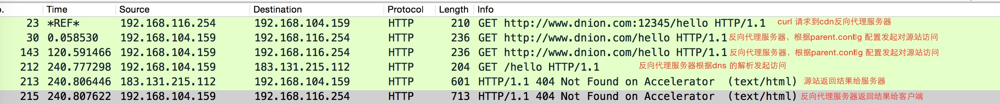
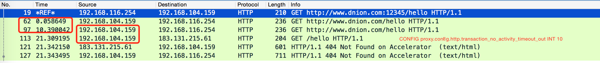

## 相关参数列举

```
CONFIG proxy.config.http.parent_proxy.retry_time INT 60
CONFIG proxy.config.http.connect_attempts_max_retries INT 2
CONFIG proxy.config.http.connect_attempts_max_retries_dead_server INT 2
CONFIG proxy.config.http.connect_attempts_rr_retries INT 3
CONFIG proxy.config.http.parent_proxy.retry_time INT 60
CONFIG proxy.config.http.connect_attempts_max_retries INT 2
CONFIG proxy.config.http.connect_attempts_max_retries_dead_server INT 2
CONFIG proxy.config.http.connect_attempts_rr_retries INT 3
CONFIG proxy.config.cache.  INT 2

CONFIG proxy.config.http.parent_proxy.retry_time INT 60
CONFIG proxy.config.http.parent_proxy.connect_attempts_timeout INT 5
CONFIG proxy.config.http.keep_alive_no_activity_timeout_in INT 15
CONFIG proxy.config.http.keep_alive_no_activity_timeout_out INT 15
CONFIG proxy.config.http.transaction_no_activity_timeout_in INT 30
CONFIG proxy.config.http.transaction_no_activity_timeout_out INT 120
CONFIG proxy.config.http.transaction_active_timeout_in INT 900
CONFIG proxy.config.http.transaction_active_timeout_out INT 0
CONFIG proxy.config.http.accept_no_activity_timeout INT 120
CONFIG proxy.config.http.background_fill_active_timeout INT 60
CONFIG proxy.config.http.connect_attempts_timeout INT 10
CONFIG proxy.config.http.post_connect_attempts_timeout INT 1800
CONFIG proxy.config.http.down_server.cache_time INT 300
```


某平台的参数
但从server_read_header_done和server_first_read这个选项来看 95点位 99点位的数据分别是4.03，25.31 
所以在设置超时参数的时候绝对不能太过激进，超过1%的数据会在25s才能返回；5%的数据要4s以上才能有数据返回。
这个值相关的选项相关配置为：
```
CONFIG proxy.config.http.parent_proxy.total_connect_attempts INT 6
CONFIG proxy.config.http.parent_proxy.per_parent_connect_attempts INT 2
CONFIG proxy.config.http.parent_proxy.connect_attempts_timeout INT 5
CONFIG proxy.config.http.transaction_no_activity_timeout_out INT 120
```

- 情况1：tcp 建立连接的时间过长，直到放弃

- 情况2：源站服务器处理时间过长，长时间未给数据，直到放弃

- 情况3：源站服务器和代理服务器之间的连接过长，超过指定参数，直到放弃

```

./slow_log_report.pl debug.log.bak 
                      key      total      count       mean     median       95th       99th        min        max
                 ua_begin       0.00    2349.00       0.00       0.00       0.00       0.00       0.00       0.00
      ua_read_header_done       0.00    2349.00       0.00       0.00       0.00       0.00       0.00       0.00
    cache_open_read_begin       0.06    2349.00       0.00       0.00       0.00       0.00       0.00       0.06
      cache_open_read_end     894.56    2349.00       0.38       0.00       0.01       5.62       0.00     127.43
         dns_lookup_begin     630.59    2349.00       0.27       0.00       0.01       0.07       0.00     240.18
           dns_lookup_end     630.59    2349.00       0.27       0.00       0.01       0.07       0.00     240.18
           server_connect     767.25    2349.00       0.33       0.00       0.01       0.07       0.00     240.18
        server_first_read    3190.48    2349.00       1.36       0.00       4.03      25.31       0.00     247.40
  server_read_header_done    3190.48    2349.00       1.36       0.00       4.03      25.31       0.00     247.40
             server_close    4335.37    2349.00       1.85       0.00       5.16      30.10       0.00     548.40
                 ua_close   43044.60    2349.00      18.32       5.78      71.46     129.14       0.03     548.40
                sm_finish   43280.67    2349.00      18.43       5.85      71.47     129.14       0.51     548.40
NOTE: Times are in seconds
```

## 测试用例1

源站收到请求后不做响应  
 访问架构及基础配置：

* parent.config 配置
  ```
  dest_domain=www.dnion.com parent="192.168.116.254:12345"
  ```
* remap.config 配置

```
regex_map http://(.*)\.dnion\.com:12345 http://$1.dnion.com dhost=*.dnion.com
```

* 访问逻辑
  ```
  client(192.168.116.254) --> proxy(192.168.104.159) --> os(192.168.116.254)
  ```

抓包分析：

```
CONFIG proxy.config.http.parent_proxy.total_connect_attempts INT 6
CONFIG proxy.config.http.parent_proxy.per_parent_connect_attempts INT 2
CONFIG proxy.config.http.parent_proxy.connect_attempts_timeout INT 5
CONFIG proxy.config.http.transaction_no_activity_timeout_out INT 120
```



```
CONFIG proxy.config.http.parent_proxy.total_connect_attempts INT 6
CONFIG proxy.config.http.parent_proxy.per_parent_connect_attempts INT 2
CONFIG proxy.config.http.parent_proxy.connect_attempts_timeout INT 5
CONFIG proxy.config.http.transaction_no_activity_timeout_out INT 10
```



## 测试用例2

源站端端口未开放

